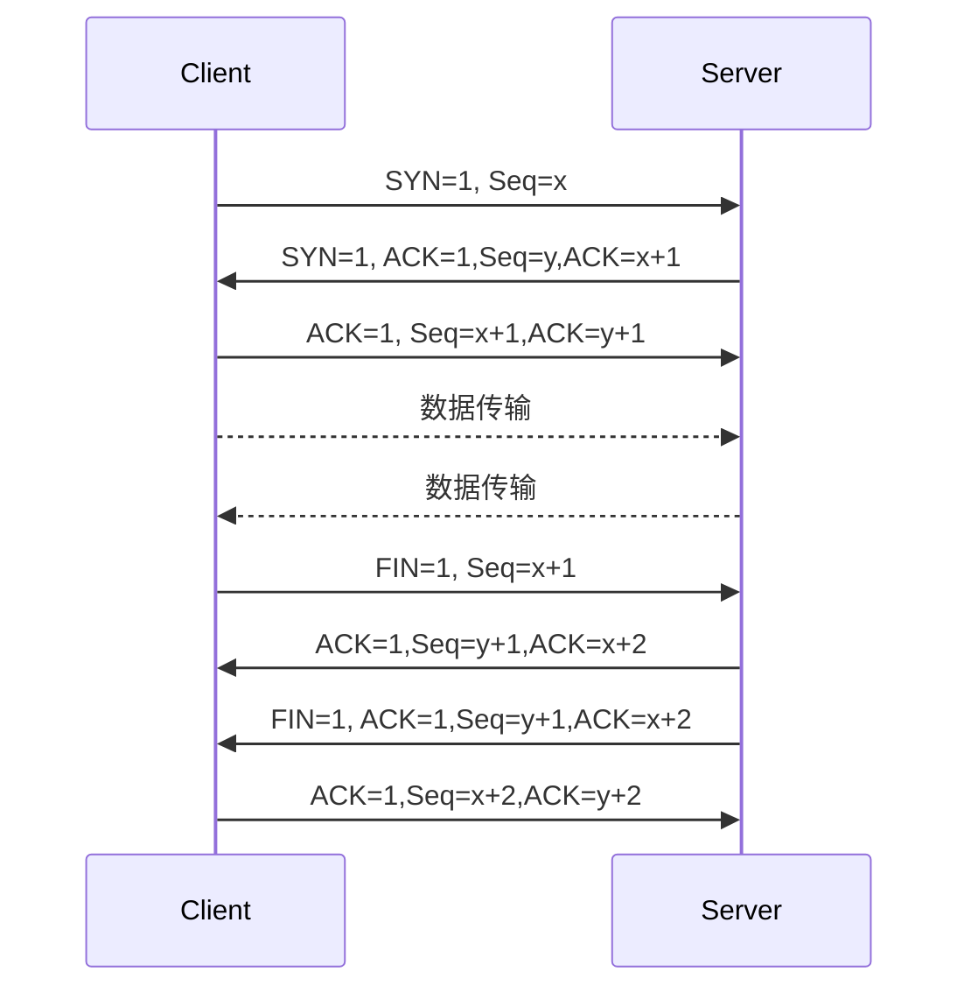

<h2 align="center">👋 嗨 我是卞辰阳 Bian.ChenYang</h2>

  <a href="https://about.kaokit.com">🏠主页</a> | 
  <a href="mailto:392729038@qq.com">📮邮箱</a>
  <a href="">🌐博客</a>
  <a href="">📈网站运行状态</a>

  
<!--
**beercrab/beercrab** is a ✨ _special_ ✨ repository because its `README.md` (this file) appears on your GitHub profile.
-->

### 😀 关于我:

- 💼 我目前从事互联网相关系统运维
- 🔭 擅长计算机网络技术
- 👨‍💻 热衷于为个人和中小企业提供互联网托管服务技术支持

### 🧰 专业技能

- 🌐 构建基于TCP/IP协议簇的企业网络基础设施服务
- 🚧 构建基于TCP/IP协议簇的企业网络安全规则
- 🔎 擅长分析数据包对网络故障排除
- ☁️ 公(私)云服务的落地实践

> PS: 企业中的路由交换和各服务器的部署维护，从网络技术的角度分析，本质都是基于互联网`TCP/IP`协议功能的延申，

### 💡 知识点演示

TCP/IP 3次握手4次挥手

